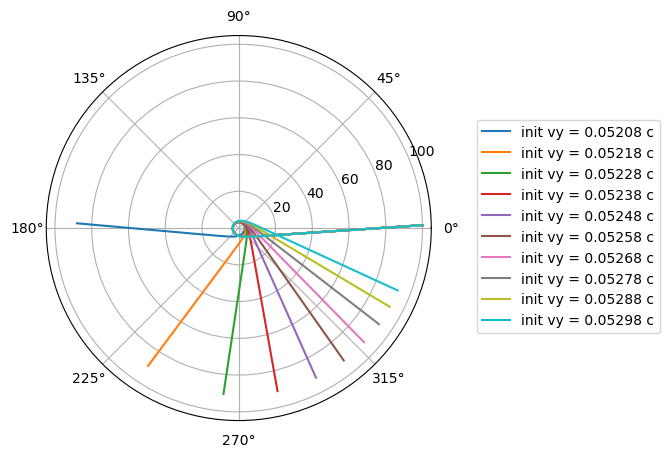

# See_a_Black_Hole

Produces BH images using ray-tracing around a spinning BH.

# Quick Start

Ray tracing by solving an ODE has been implemented in C++.
Some generated results (may contain problems currently) are under `/notebook/debug_figs` directory
For now, you can play around with the results in `data` which includes some simulations in the equator plane.

# Results
The image of the photon ring:

Trajectories of photons

# Implementation

To generate the image, assume the background is homogeneously illuminating. By calculating how a very locally 
centered beam "splits up" after being bent by the BH, we can calculate the relative illumination in that direction.

# To-do
- compare with theory and debug
- effect of the accretion disk 

# Reference

### Black Hole

[Kerr Spherical Photon Orbits](https://duetosymmetry.com/tool/kerr-circular-photon-orbits/)

[Ray Tracing in Curved Space Time](http://locklessinc.com/articles/raytracing/)

[Ray Tracing in Curved Space Time](https://www.codeproject.com/Articles/994466/Ray-Tracing-a-Black-Hole-in-Csharp)

### Ray Tracing

[Ray Tracing in One Weekend](https://raytracing.github.io/books/RayTracingInOneWeekend.html)

[Coding Adventure](https://www.youtube.com/watch?v=DxfEbulyFcY&list=PLFt_AvWsXl0ehjAfLFsp1PGaatzAwo0uK&index=5)

### Accretion Disk & Volumetric Rendering

Page, D. N.; Thorne, K. S. (1974). "Disk-Accretion onto a Black Hole. Time-Averaged Structure of Accretion Disk". Astrophys. J. 191 (2): 499–506.

Luminet, J. P. (1979). "Image of a spherical black hole with thin accretion disk". Astron. Astrophys. 75 (1–2): 228–235.
